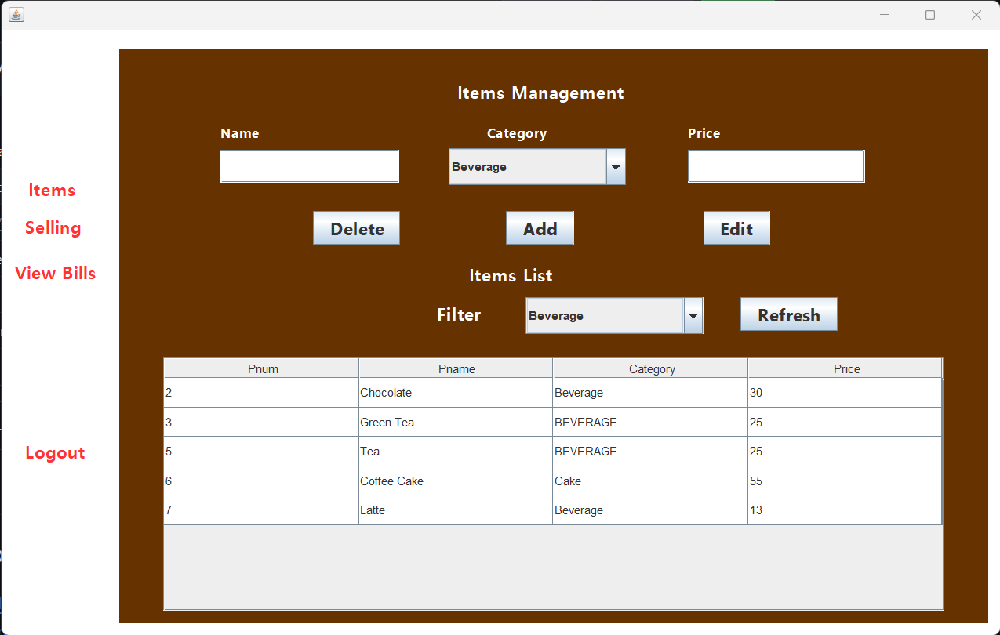
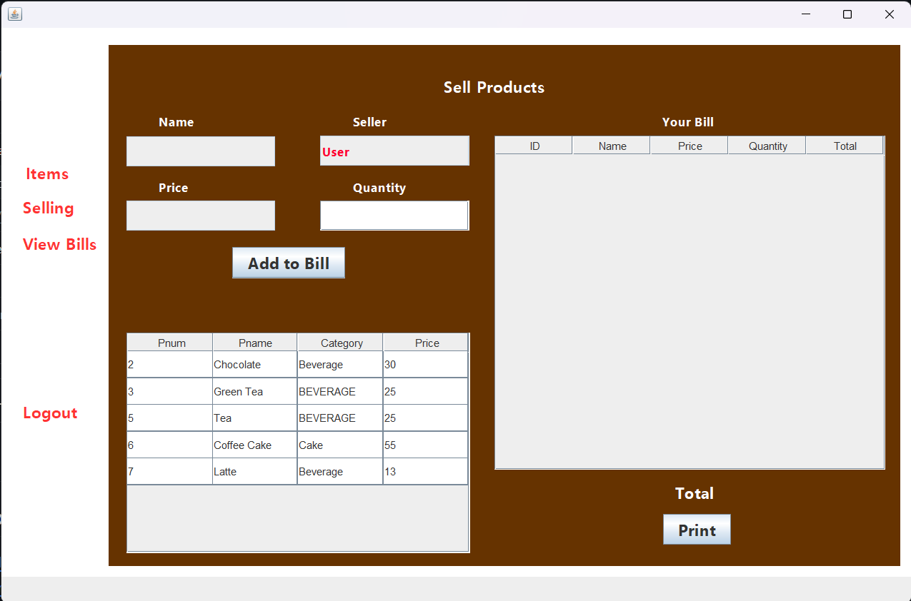
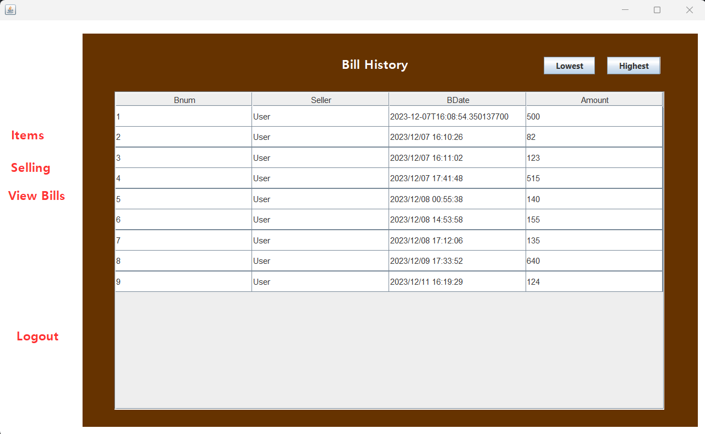

# Cafe Management System

## Table of Contents
1. [Introduction](#introduction)
2. [Features](#features)
3. [Technologies Used](#technologies-used)
4. [Setup](#setup)
5. [Usage](#usage)
6. [Screenshots](#screenshots)
7. [Contributing](#contributing)
8. [Acknowledgements](#acknowledgements)

## Introduction

The Cafe Management System is a Java-based application designed to streamline and automate the operations of a cafe. The system consists of three main modules: item management, cashier operations, and auditing. Users can manage the cafe's menu, process customer orders, and maintain a detailed audit log of transactions.

## Features

### 1. Item Management
- **Add Items:** Users can add new items to the cafe menu, specifying details such as item name, price, and category.
- **Edit Items:** Allows for the modification of existing item details, such as price or category.
- **Delete Items:** Users can remove items that are no longer part of the cafe's offerings.

### 2. Cashier Operations
- **Order Processing:** Cashiers can select items and input the quantity for each item in a customer's order.
- **Total Bill Calculation:** The system calculates the total bill based on the items and quantities entered.
- **Print Option:** Cashiers can print the final bill, including the total amount due.

### 3. Auditing
- **User and Transaction Logging:** The system logs user activities and transaction details, including timestamps.
- **Downloadable Audit Reports:** A detailed audit report can be downloaded, providing insights into the cafe's operations.

### 4. Authentication
- **Sign In/Sign Out:** Users can securely sign in and out of the system, ensuring data security and user accountability.

## Technologies Used

- **Java:** The core programming language for building the application logic.
- **MySQL:** Used for database management to store and retrieve data.
- **JavaFX:** Employed for creating the graphical user interface (GUI).
- **Maven:** Dependency management and project build tool.

## Application Setup/ How to run

1. **Database Setup:**
    - Create a MySQL database and import the provided schema.
    - Update the `constants.java` file with the appropriate database connection details.

2. **Java Development Kit (JDK):**
    - Ensure you have a compatible JDK installed (e.g., JDK 8 or later).

3. **Maven:**
    - Install Maven on your system.
    - Open the project as Maven Project in Netbeans
    - Build the project using the `mvn clean install` command.

 
4. **Add MySQL Connector to Maven:**
   - Open your project's `pom.xml` file.
   - Add the MySQL Connector and DbUtils dependencies:

     ```xml
     <dependencies>
         <!-- MySQL Connector -->
         <dependency>
             <groupId>mysql</groupId>
             <artifactId>mysql-connector-java</artifactId>
             <version>8.0.23</version> <!-- Use the latest version -->
         </dependency>

         <!-- DbUtils -->
         <dependency>
             <groupId>net.sourceforge.dbutils</groupId>
             <artifactId>commons-dbutils</artifactId>
             <version>1.7</version> <!-- Use the latest version -->
         </dependency>
     </dependencies>
     ```

5. **Download DbUtils Package:**
   - Download `res2xml.jar` from SourceForge [here](https://sourceforge.net/projects/res2xml/).
   - Add `res2xml.jar` to your project.

6. **Create MySQL Database:**
   - Open your MySQL client.
   - Execute the following SQL commands:

     ```sql
     CREATE DATABASE IF NOT EXISTS cafeDb;
     USE cafeDb;

     CREATE TABLE IF NOT EXISTS ProductTbl (
         Pnum INT PRIMARY KEY AUTO_INCREMENT,
         Pname VARCHAR(255),
         Category VARCHAR(40),
         Price INT
     );

     CREATE TABLE IF NOT EXISTS BillTbl (
         Bnum INT PRIMARY KEY AUTO_INCREMENT,
         Seller VARCHAR(30),
         BDate VARCHAR(30),
         Amount INT
     );
     ```
7. **Run the Application:**
    - Execute the generated JAR file or run the application from the IDE.

## Usage

1. **Item Management:**
    - Navigate to the "Items" page to add, edit, or delete items from the cafe menu.

2. **Cashier Operations:**
    - Access the "Cashier" page to process customer orders, calculate the total bill, and print the final bill.

3. **Auditing:**
    - Explore the "Auditing" page to view user activities and transaction logs. Download audit reports for detailed analysis.

4. **Authentication:**
    - Use the sign-in and sign-out functionality to secure access to the system.

## Screenshots


*Figure 1: Item Management Page*


*Figure 2: Cashier Operations Page*


*Figure 3: Auditing Page*

## Project Collaboration Summary

## Task 1: UI Layout and Item Page
- Designed and implemented the Item Page layout with sections for reading, adding, deleting, and updating items.
- Integrated the filter functionality on the Item Page based on item type.

## Task 2: Selling Page and Quantity Management
- Designed and implemented the Selling Page layout.
- Implemented the functionality to select items, input quantities, and add items to the bill.
- Designed the layout for generating printed bills in PDF format.

## Task 3: Bills and Login/Logout
- Implemented the login and logout functionality.
- Designed the layout for the Bills Page and implemented functionality to fetch and display all bills.
- Used Lambdas to show the highest and lowest recorded bills.

## Task 4: Database Setup and Cafe
- Assisted in setting up the database.
- Set up SQL Queries.

## Task 5: Cafe Factory and Cafe Item
- Collaborated on the implementation of the Cafe Factory.
- Contributed to the development of the Cafe Item class.

## Task 6: Beverage and Item Bill Changes
- Contributed to the implementation of the Beverage Factory.
- Worked on the development of the Beverage Item class.
- Collaborated on changes to the Item Bill class based on project requirements.

## Task 7: Cake Factory and Shake
- Collaborated on the implementation of the Cake Factory.
- Contributed to the development of the Cake Item class.
- Worked on the implementation of the Shake Factory.
- Contributed to the development of the Shake Item class and categories.


## Acknowledgements

Special thanks to the developers and contributors who have helped make this project possible and prof Daniel Peters. Your contributions are highly appreciated.
